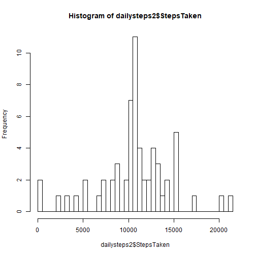

Reproducible Research
=====================

This is the output for the Course Project 1.

### Loading and preprocessing the data

Here is the code to set the working directory. This varies depending on the device that you are using, and as for mine, it is as follows:

```r
setwd("C:/Users/10012223/Desktop/Coursera Videos/05 Reproducible Research/Week 2/Course Project")
```

Then, we will read the data with file name "activity.csv" into an R variable using the code snippets.  
Using the function *head*, I displayed the first 6 rows of the data.

```r
activity <- read.csv("activity.csv")
head(activity)
```

```
##   steps       date interval
## 1    NA 2012-10-01        0
## 2    NA 2012-10-01        5
## 3    NA 2012-10-01       10
## 4    NA 2012-10-01       15
## 5    NA 2012-10-01       20
## 6    NA 2012-10-01       25
```

### What is mean total number of steps taken per day?

For this part, I will be ignoring the missing values in the dataset (i.e., those with filled values of NA).

#### Calculating the number of steps taken per day

The following lines of code are used to calculate the number of steps taken.

```r
library(dplyr)
dailysteps <- activity %>% group_by(date) %>% summarise(StepsTaken = sum(steps)) %>% na.omit()
head(dailysteps)
```

#### Making a histogram of the total number of steps taken per day

This is to illustrate the number of steps taken per day using a histogram, which is produced by the lines of code that follows. I also used the number of rows of dataset *dailysteps* to represent the number of breaks in the histogram.

```r
hist(dailysteps$StepsTaken, breaks = nrow(dailysteps))
```


#### Mean and Median of the Total Number of Steps Taken

This produces the output of the mean and median of the the total number of steps taken.


```r
mean <- mean(dailysteps$StepsTaken)
median <- median(dailysteps$StepsTaken)
mean
```

```
## [1] 10766.19
```

```r
median
```

```
## [1] 10765
```

### What is the average daily activity pattern?

#### Time Series Plot of the 5-minute Interval

This illustrates the total steps taken for 5-minute interval accros all days.  
*intervalSteps* is the variable that stored the tabular data, which is a summarized form of the *activity* dataset, only grouped by **interval**  
As for the plot, the green vertical line, it is the interval that has the maximum number of steps.


```r
intervalSteps <- activity[complete.cases(activity),]
intervalSteps <- intervalSteps %>% group_by(interval) %>% summarise(StepsTaken = mean(steps))
with(intervalSteps, {
  plot(x = interval, y = StepsTaken, type = "l")
  abline(v = intervalSteps[which(intervalSteps$StepsTaken == max(intervalSteps$StepsTaken)),][1,1],
         col = "green")
})
```


The interval that has the most number of steps is:


```r
intervalSteps[which(intervalSteps$StepsTaken == max(intervalSteps$StepsTaken)),][1,1]
```

```
## # A tibble: 1 x 1
##   interval
##      <int>
## 1      835
```

### Imputing Missing Values

Missing values are coded as **NA** in the dataset, and this presence can produce bias or discrepancies in summarizing the dataset that we have. In our initial dataset *activity*, we have to calculate the number of missing values and report it using the code that follows:


```r
NACount <- sum(is.na(activity))
```

And this wil produce **2304** numbers of NA or missing values in our dataset.

In order to replace (or impute) the missing values, we have to devise a way to fill these data, and one way for it to do is by replacing it with values that are correlated to the numbers that we will fill these set. And by this, I mean using the mean of each interval for the day. Here I created a function named *replaceNA*


```r
replaceNA <- function(x){
  replace(x, is.na(x), mean(x, na.rm = TRUE))
}
```

Now we create a new dataset that will replicate the same set as *activity* but will have no missing values, in our case **NA**. We will assign this new dataset to a variable name *replacedNA*.


```r
replacedNA <- activity %>% group_by(interval) %>% mutate(steps = replaceNA(steps))
```

Using the same method that we did for the first part, we will be able to produce a new histogram.


```r
dailysteps2 <- replacedNA %>% group_by(date) %>% summarise(StepsTaken = sum(steps))
hist(dailysteps2$StepsTaken, breaks = nrow(dailysteps2))
```



And we also need to calculate the new mean and median for the new dataset that we did.


```r
newMean <- mean(dailysteps2$StepsTaken)
newMedian <- median(dailysteps2$StepsTaken)
```

We can see that the mean didn't change even if we replace the missing values with means of their intervals, but the median increased from *10765* to *1.0766189 &times; 10<sup>4</sup>*.

### Are there differences in activity patterns between weekdays and weekends?

We will now create a new column in the dataset that we has just newly created, *dailysteps2*, and we will call this *day* to know if a date fall under a weekday or weekend.


```r
replacedNA$day <- ifelse(weekdays(as.Date(dailysteps2$date)) %in% c("Saturday", "Sunday"), "weekend", "weekday")
```


```r
library(ggplot2)
WeekdayData <- replacedNA %>% group_by(day, interval) %>% summarise(steps = mean(steps))
qplot(interval, steps, data = WeekdayData, geom = c("line"), col = day, facets = day ~ .,
     ylab = "Number of Steps", xlab = "Interval", main = "Weekdays vs Weekend")
```


